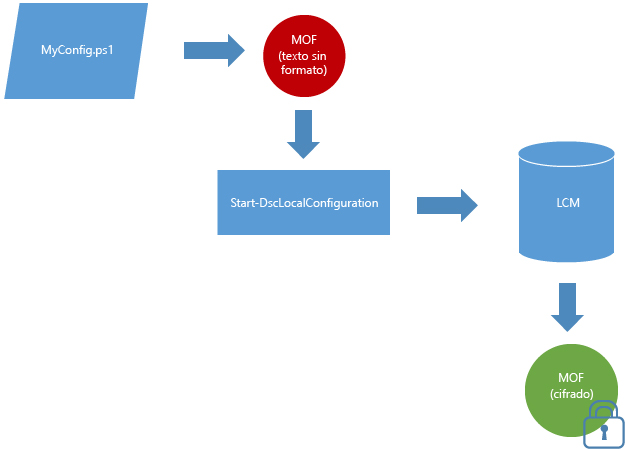

# Los documentos MOF están cifrados de forma predeterminada

Los documentos de configuración contienen información confidencial. En versiones anteriores de DSC era necesario distribuir y administrar certificados para proteger las credenciales en una configuración. Para muchos, esto suponía una carga de administración considerable e incluso con todo el trabajo que requería, aún quedaba información de configuración que no estaba protegida ni se podía proteger.

Esto ya no es así, porque **todos los MOF de configuración están protegidos de forma predeterminada**. No se necesitan certificados ni valores de metaconfiguración. Cada vez que el Administrador de configuración local (LCM) guarda un MOF de configuración en el disco en un nodo de destino, dicho documento se cifra. Los MOF se cifran mediante [DPAPI](https://msdn.microsoft.com/library/ms995355.aspx). **Nota:** Los MOF que genera un script de configuración no están cifrados.

**Ejemplo:** Cifrado en modo de inserción 

Si ya está usa el método del certificado para cifrar contraseñas o si necesita seguridad adicional para las contraseñas, el [método existente de cifrado basado en certificados](https://msdn.microsoft.com/powershell/dsc/securemof) seguirá funcionando. El resultado será un documento MOF completamente cifrado mediante DPAPI, que además incluirá contraseñas cifradas.

Este cifrado solo se aplica a documentos MOF de configuración (pending.mof, current.mof, previous.mof y MOF parciales). Los MOF de metaconfiguración se siguen guardando en texto sin formato, ya que es menos probable que contengan secretos.
